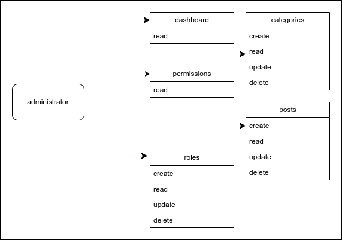
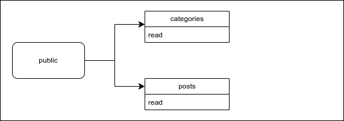

## Base Restful API


#### users diagram





#### example of use
https://github.com/qrizan/react-tailwind-roles

## setup

#### install dependencies
> composer install

#### copy .env
> cp .env.example .env

#### generate application key
> php artisan key:generate

#### generate secret key
> php artisan jwt:secret

#### storage link
> php artisan storage:link

#### DB configuration
> create database

```
DB_CONNECTION=mysql
DB_HOST=127.0.0.1
DB_PORT=3306
DB_DATABASE=<DB_NAME>
DB_USERNAME=<DB_USERNAME>>
DB_PASSWORD=<DBs_PASSWORD>
```
#### data example 
> database/seeders/UserTableSeeder.php

> database/seeders/PermissionsTableSeeder.php

> database/seeders/RolesTableSeeder.php

#### database migration
> php artisan config:cache

> php artisan config:clear

> composer dump-autoload

> php artisan migrate --seed

#### runnning
> php artisan serve

#### API documentation
``` 
http://localhost:8000/api/documentation
```


