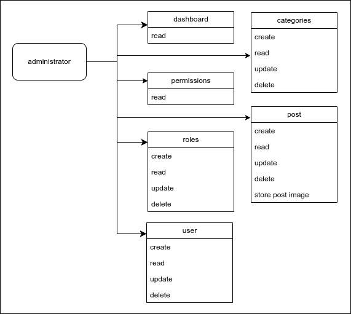

## News Article Restful API

#### built with

| Tools  |  |
| :--- | :--- |
| Laravel  | https://laravel.com  |
| Spatie  | https://spatie.be  |
| Swagger | https://swagger.io  |
| etc |  |


#### users diagram



#### example of use

##### administrator
https://github.com/qrizan/react-tailwind-roles

https://github.com/qrizan/vue-tailwind-roles

##### public
https://github.com/qrizan/nextjs-tailwind-storybook

## setup

#### install dependencies
```
composer install
```
#### copy .env
```
copy .env.example .env
```
#### generate application key
```
php artisan key:generate
```
#### generate secret key
```
php artisan jwt:secret
```
#### storage link
```
php artisan storage:link
```
#### DB configuration
- create database and setup .env

```
DB_CONNECTION=mysql
DB_HOST=127.0.0.1
DB_PORT=3306
DB_DATABASE=<DB_NAME>
DB_USERNAME=<DB_USERNAME>>
DB_PASSWORD=<DB_PASSWORD>
```
#### data example 
> database/seeders/UserTableSeeder.php

> database/seeders/PermissionsTableSeeder.php

> database/seeders/RolesTableSeeder.php

#### database migration and seeder
```
php artisan config:cache
php artisan config:clear
composer dump-autoload
php artisan migrate --seed
```
#### runnning
```
php artisan serve
```
#### API documentation

> check Url http://localhost:8000/api/documentation


